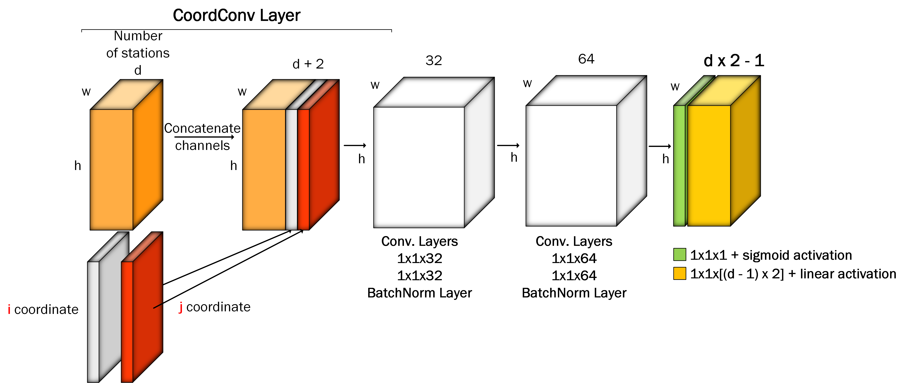

# LOOT: Look Once On Tracks

**LOOT** is YOLO-like convolutional neural network for particle track reconstruction. 

The network consumes the whole event as, if it is  a picture, but instead of RGB channels we replace  them by discretized contents of detector stations considering each of them as a channel in depth. In this way, we obtain the input tensor which depth equal to the number of stations, its width and height depend on the resolution of the detector, i.e. the size of the biggest station. This means our model representsthe whole event with all  tracks and noisy hits in it on the global level.

## Publications
- [The Particle Track Reconstruction Based On Deep Neural Networks](https://arxiv.org/ftp/arxiv/papers/1812/1812.03859.pdf)